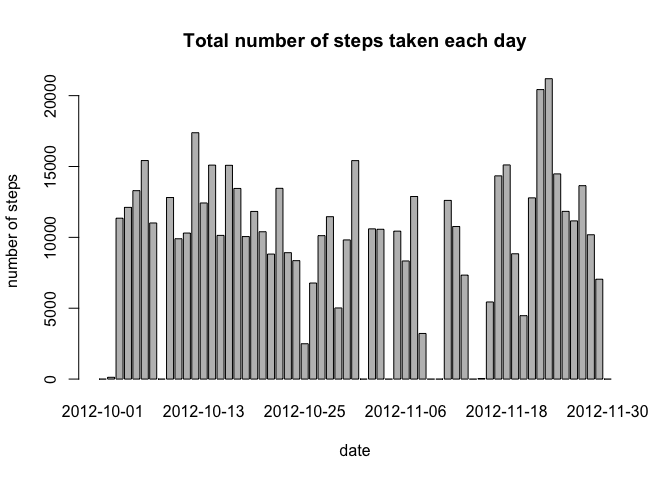
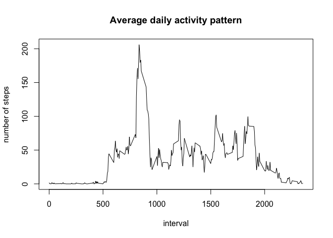
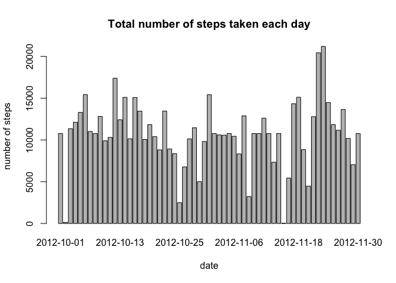
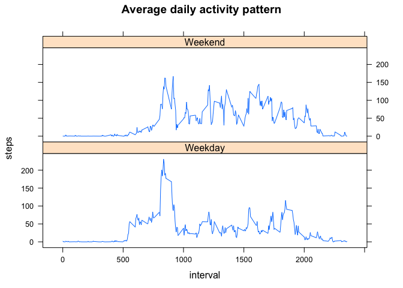

# Reproducible Research: Peer Assessment 1


## Loading and preprocessing the data

The file is unzip and read in to a data frame using read.csv

```r
data <- read.csv(unz("activity.zip", "activity.csv"))
```
## What is mean total number of steps taken per day?

Here is the histrogram.

```r
totalStepDaily <- with(data,tapply(steps,date,sum,na.rm=TRUE))
barplot(totalStepDaily,main="Total number of steps taken each day",xlab="date", ylab="number of steps")
```

<!-- -->

```r
StepMean <- mean(totalStepDaily)
StepMedian <- median(totalStepDaily)
```
The mean of the total number of steps taken per day is 9354.2295082 while the median is 10395

## What is the average daily activity pattern?


```r
meanStepInterval <- with(data,tapply(steps,interval,mean,na.rm=TRUE))
plot(x=names(meanStepInterval),y=meanStepInterval,type="l",main="Average daily activity pattern",xlab="interval", ylab="number of steps")
```

<!-- -->

```r
MaxInterval <- names(which.max(meanStepInterval))
```
On average across all the days in the dataset, the interval 835 contains the maximum number of steps.

## Imputing missing values

```r
TotalNA <- sum(is.na(data$steps))
```
The total number of NAs is 2304

Create new data set by replacing the missing value by the mean for the same 5-minute interval accross all days.

```r
newdata <- data
for (i in 1:length(newdata$steps))
  if (is.na(newdata$steps[[i]]))
    newdata$steps[[i]] <- meanStepInterval[[as.character(newdata$interval[[i]])]]
```
Here is the updated histogrm.

```r
newTotalStepDaily <- with(newdata,tapply(steps,date,sum,na.rm=TRUE))
barplot(newTotalStepDaily,main="Total number of steps taken each day",xlab="date", ylab="number of steps")
```

<!-- -->

```r
NewStepMean <- mean(newTotalStepDaily)
NewStepMedian <- median(newTotalStepDaily)
```
The updated mean of the total number of steps taken per day is 1.0766189\times 10^{4} while the median is 1.0766189\times 10^{4}. 

Compare to the original data, the mean and median slightly increase and the distribution is more even since the 0 total steps are now replaced by the average total steps.

## Are there differences in activity patterns between weekdays and weekends?

The weekday of the date is determinded then the data is split into 2 groups, weekday and weekends. The average number of steps taken, averaged across all weekday days or weekend days can then be calculated and plot.

```r
week <- weekdays(as.Date(as.character(newdata$date)))
for (i in 1:length(week)){
  if (week[i]=="Saturday" | week[i]=="Sunday") week[i] <- "Weekend"
  else week[i] <- "Weekday"
}
newdata2 <- cbind(newdata,week)

weekMeanStepInterval <- aggregate(steps ~ interval+week,newdata2,mean)

library(lattice)
xyplot(steps ~ interval | week,data=weekMeanStepInterval,layout=c(1,2),type="l",main="Average daily activity pattern")
```

<!-- -->

From the plot, it can be noticed that during the weekend, the high activity period (more steps during the interval) is widely spread over the midday. On the other hand, during the weekday, only a certain period of time there's a high activity.
